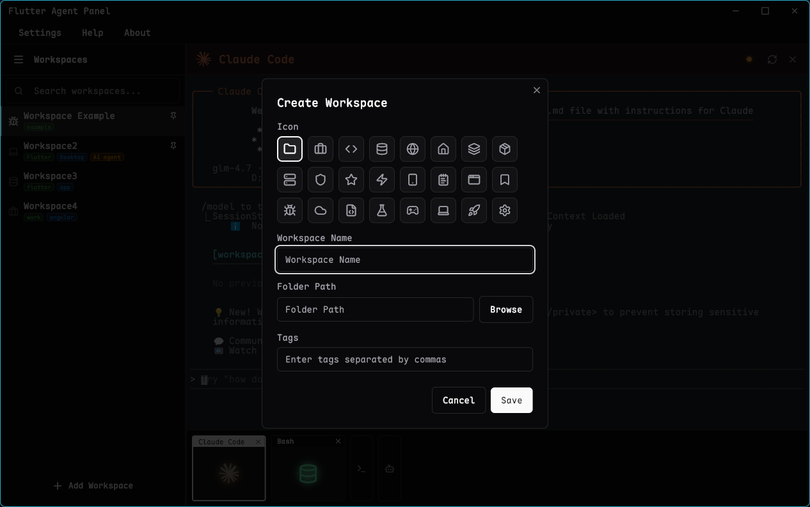
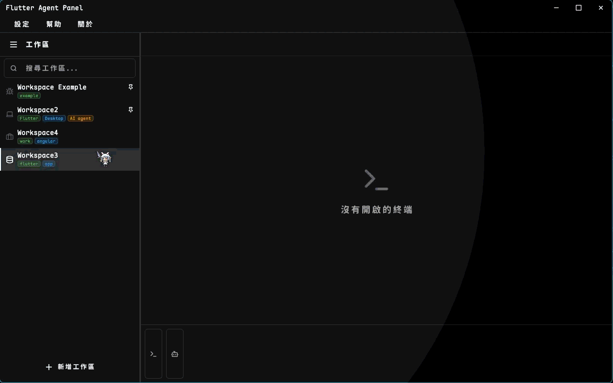
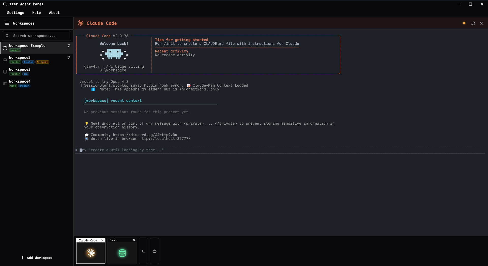
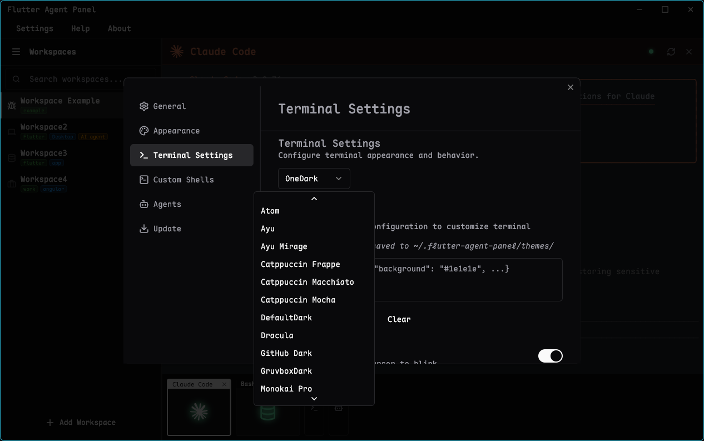
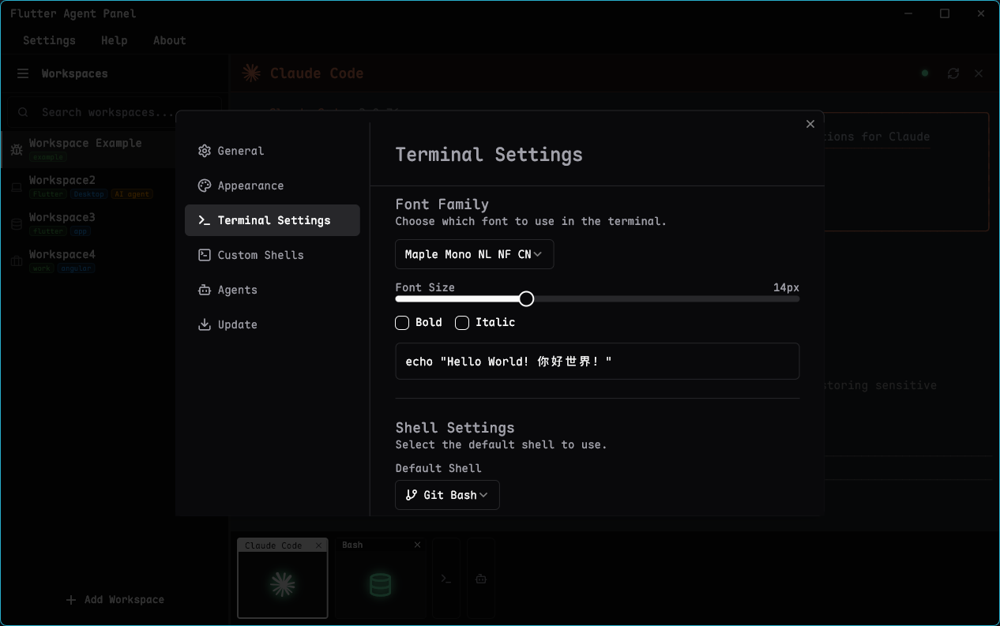

# Flutter Agent Panel


**A modern, cross-platform terminal aggregator designed for the AI era.**

[English](README.md) | [繁體中文](README_zh-TW.md)

---

## TL;DR
Flutter Agent Panel is a powerful desktop application that combines a robust **terminal emulator** with **AI Agent management**. It allows you to organize your work into **Workspaces**, run multiple terminals side-by-side, and seamlessly integrate CLI-based AI agents (like Claude Code, GitHub Copilot CLI) into your workflow.

**Why use this?**
*   **Unified Interface**: Stop switching between your code editor's terminal and separate AI chat windows.
*   **Persistent Context**: Workspaces keep your terminals and agents organized by project.
*   **Cross-Platform**: Runs smoothly on Windows, macOS, and Linux (built with Flutter).

---

## Introduction & Motivation
The landscape of software development is changing. We no longer just run commands; we interact with intelligent agents. **Flutter Agent Panel** was created to solve the fragmentation of developer tools.

**The Pain Point:**
Developers often juggle multiple terminal windows for servers, git commands, and now, AI agents. Managing these contexts is tedious.

**The Solution:**
This app provides a unified "Agent Panel" where standard terminals and AI agents coexist.
*   **Inspired by**: This project is heavily inspired by [better-agent-terminal](https://github.com/tony1223/better-agent-terminal). Check out their project as well!

## Key Features
1.  **Multi-Workspace Management**: Group your terminals by project or context. Switch between workspaces instantly without losing your state.
2.  **Professional Terminal Emulator**: Built on `xterm.dart` and `flutter_pty`, offering a fully functional terminal experience with ligature support, custom fonts, and theming.
3.  **AI Agent Integration**:
    *   **Presets**: One-click setup for popular AI CLIs like **Claude Code**, **Qwen Code**, **Codex**, **Gemini**, **OpenCode** and **GitHub Copilot**.
    *   **Configuration**: Customize launch commands, environment variables, and working directories for each agent.
4.  **Modern UI/UX**:
    *   Sleek interface built with [shadcn_ui](https://flutter-shadcn-ui.mariuti.com/).
    *   Dark/Light mode support.
    *   Responsive design.

## Usage Guide

### 1. Managing Workspaces
Organize your tasks by creating separate workspaces. Each workspace maintains its own set of terminals and agents.

Drag and drop to reorder workspaces.


### 2. Using the Terminal
Supports multiple terminals (PowerShell, Bash, Zsh, cmd.exe, WSL, etc.) via `xterm.dart`, with custom shell support for a smooth experience.

Rich built-in themes with support for importing custom theme JSON.

Customize font size, font family, font weight, italics, and more.

Drag and drop to reorder terminals.


### 3. Launching AI Agents
Access the Agent menu to launch pre-configured AI assistants. The app handles the command execution and environment setup for you.

*Integration supports: Claude, Gemini, Copilot, and custom commands.*


## Development
To build and run this project locally:

```bash
# Get dependencies
flutter pub get

# Run the app
flutter run

# Generate code (for updated dependencies)
dart run lean_builder build --delete-conflicting-outputs
```

